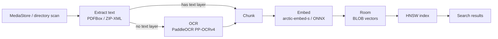

<div align="center">
  

  <p></p>

  [](LICENSE)
  [](https://github.com/Arjun941/seekmydocs/releases)
  [](https://github.com/Arjun941/seekmydocs/releases)
  [](https://kotlinlang.org)
  [](https://developer.android.com)
  [](https://developer.android.com/jetpack/compose)
</div>

---

**SeekMyDocs** is an offline, privacy-first document search engine for Android. It indexes documents already on your device — PDFs, Office files, text, and more — and lets you find them instantly with filename, keyword, OCR, or on-device semantic search. No document content, embedding, or query ever leaves the device, and no network access is used at all.

## Features

- 🔄 **Automatic background indexing** of documents on external storage (Downloads, Documents, MediaStore) via WorkManager, running every ~4 hours under battery/idle constraints
- ⚡ **Real-time re-indexing** while the app is open, using a `ContentObserver` on the MediaStore
- 🧩 **Incremental indexing** — files are re-indexed only when their name/size/modified-time hash changes, and byte-identical duplicate files reuse an existing document's embeddings instead of re-processing
- 🔍 **Hybrid search** combining:
  - Filename matching
  - Keyword / full-text search over extracted content
  - OCR text search (for scanned PDFs/images)
  - On-device semantic (vector) search over chunk embeddings, retrieved via an in-process HNSW approximate-nearest-neighbor index (exact brute-force search below a small corpus size)
- 📈 **Ranked results** using a weighted score combining relevance, recency, and how often a document has been opened
- 🧪 **Sandbox/demo mode** that generates sample documents (resume, bill, timetable, etc.) so search can be tried without real files
- 📤 **Open/share documents** directly from search results via a `FileProvider`
- 📊 **Dashboard** showing indexing stats: documents indexed, chunks, embeddings generated, OCR pages cached, storage used, last sync time
- ⚙️ **Settings** to toggle auto-indexing, OCR, semantic search, and dark mode

### Supported document formats

<div align="center">

`PDF` `DOC` `DOCX` `XLS` `XLSX` `PPT` `PPTX` `TXT` `CSV` `MD` `JSON` `XML` `EPUB` `ODT` `ODS` `ODP`

</div>

For PDFs, the real embedded text layer is extracted directly (via PDFBox) whenever one exists — OCR only runs as a fallback for image-only/scanned PDFs with no usable text layer. All other formats are parsed procedurally (ZIP/XML for Office & OpenDocument formats, plain text otherwise) and never go through OCR.

## Architecture

SeekMyDocs is a single-module Android app: Kotlin + Jetpack Compose on top of an MVVM architecture (`ViewModel` + `StateFlow` driving the Compose UI), Room for local persistence, and WorkManager for background indexing. Every ML component — embeddings, OCR, and the vector index — runs fully on-device.

| Layer | Technology |
|---|---|
| Language | Kotlin |
| UI | Jetpack Compose (Material 3) |
| Architecture | MVVM (`ViewModel` + `StateFlow` → Compose UI) |
| Local storage | Room |
| Background work | WorkManager |
| On-device embeddings | Snowflake `arctic-embed-s` (384-dim, int8 ONNX), run via ONNX Runtime Mobile; model + tokenizer are bundled as APK assets — nothing downloaded at runtime |
| Semantic index | In-process HNSW (hand-rolled), rebuildable from Room; exact brute-force fallback for small corpora |
| OCR | PaddleOCR PP-OCRv4 (detection + orientation + recognition ONNX models), run via ONNX Runtime with OpenCV for geometric pre/post-processing |
| PDF/text extraction | PDFBox-Android (real text layer), custom ZIP/XML parsing for Office & OpenDocument formats |
| Testing | JUnit, Robolectric, Espresso, Roborazzi (screenshot tests) |

### Project structure

```
app/src/main/java/com/example/
├── MainActivity.kt
├── core/
│   ├── embeddings/   # On-device embedding engine (arctic-embed-s / ONNX)
│   ├── extraction/   # Document text extraction
│   ├── indexing/     # Background & on-demand indexing workers, chunking, MediaStore observer
│   ├── ocr/          # OCR engine (PaddleOCR / ONNX + OpenCV)
│   └── search/       # Search pipeline, ranking, and the HNSW vector index
├── data/
│   ├── database/     # Room entities, DAO, database
│   └── repository/   # Indexing repository
├── presentation/
│   ├── MainViewModel.kt
│   └── ui/           # Compose screens
└── ui/theme/         # Compose theming
```

### Indexing pipeline



## Getting Started

### Prerequisites

- [Android Studio](https://developer.android.com/studio) (recent stable version) or a command-line Gradle/JDK 17 setup
- **Gradle 9.3.1+** — required by AGP 9.1.1. The committed Gradle wrapper (`gradlew`/`gradlew.bat`) will download it automatically on first run
- A physical device or emulator running **Android 7.0 (API 24)** or higher

### Setup

1. Clone the repository and open it in Android Studio (or run `./gradlew installDebug` from the command line).
2. Let Android Studio sync Gradle and resolve any suggested fixes.
3. For debug builds, Android Studio will generate/use a local `debug.keystore` automatically. If building from the command line, generate one at the project root:
   ```
   keytool -genkeypair -v -keystore debug.keystore -alias androiddebugkey \
     -storepass android -keypass android -keyalg RSA -keysize 2048 -validity 10000 \
     -dname "CN=Android Debug,O=Android,C=US"
   ```
4. Run the app on an emulator or physical device.

Everything the app needs (embedding model, tokenizer, OCR models) ships inside the APK — no internet connection is required at any point, including first launch.

### Permissions

The app requests:
- `READ_EXTERNAL_STORAGE` / `MANAGE_EXTERNAL_STORAGE` — to scan documents across device storage

### Prebuilt APKs

Prebuilt, signed APKs (per-architecture and universal) are published on the [Releases page](https://github.com/Arjun941/seekmydocs/releases) — no build step required if you just want to try the app.

## Building a Release

Release builds are signed using a keystore referenced by environment variables in `app/build.gradle.kts`:

- `KEYSTORE_PATH` (defaults to `${rootDir}/my-upload-key.jks`)
- `STORE_PASSWORD`
- `KEY_PASSWORD`

Supply your own keystore and credentials before building a release APK/AAB — none are committed to the repository. The app is built with per-ABI splits (`arm64-v8a`, `armeabi-v7a`, `x86`, `x86_64`) plus a universal APK.

## Contributing

Contributions are welcome — bug fixes, new format support, performance improvements, and documentation are all useful.

- **Never commit or open PRs directly against `main`.** Create a separate branch for your change:
  ```
  git checkout -b fix/short-description
  ```
  (use `feat/`, `fix/`, `docs/`, `chore/`, etc. as a prefix for the branch name)
- Keep PRs focused — one logical change per PR is easier to review than a bundle of unrelated fixes.
- Make sure the project builds and existing tests pass before opening a PR:
  ```
  ./gradlew testDebugUnitTest
  ```
- Add or update tests for behavior you change, where practical.
- Write a clear PR description: what changed and why, not just what.
- For larger changes (new dependencies, architecture changes, new features), please open an issue to discuss the approach first — it saves rework on both sides.

## License

<div align="center">

[](LICENSE)

</div>

Licensed under the **GNU General Public License v3.0** — see [LICENSE](LICENSE) for the full text.
